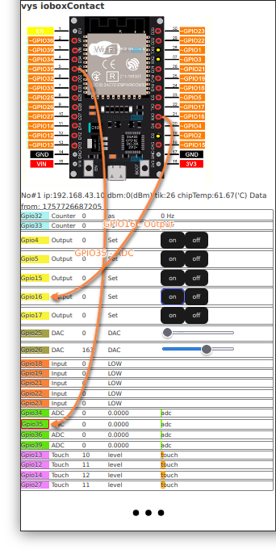

# viteyss-site-ioboxContact

To see what my **io-box** can see. 
And to teal to **io-box** what to do.

## parts

* [esp32 io-box](https://github.com/yOyOeK1/oiyshTerminal/tree/main/esp32IOBox1) - firmware, descriptions
* [viteyss](https://github.com/yOyOeK1/viteyss) or [node-red-contrib-viteyss](https://github.com/yOyOeK1/node-red-contrib-viteyss) to host
* this viteyss-site-ioboxContact in your running (yss)[https://github.com/yOyOeK1/oiyshTerminal] instance 
